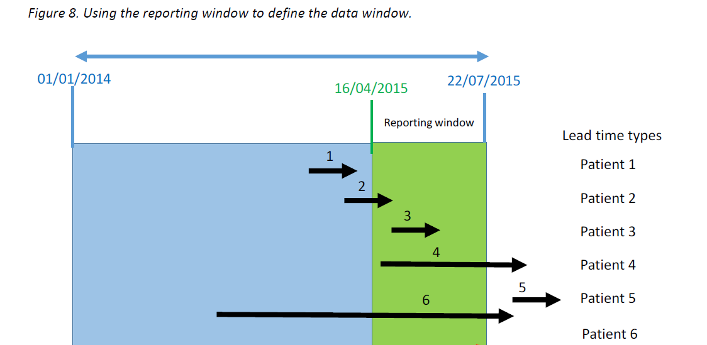

```{r setup, include=FALSE}
knitr::opts_chunk$set(echo = TRUE,
                      eval = FALSE)
```

```{r intro-pic, fig.cap="Photo of pink tulip with frilly ends of petals", echo=FALSE, eval=TRUE}

```

I wrote a similar [blog](https://lextuga007.github.io/PhilosopherAnalyst/posts/2021-05-01-creating-a-caseload-over-time-in-r/), with almost the same title and everything, but with R and now SQL gets its time to shine! I said in the previous blog that I'd spent a long time puzzling over the problem of counts over a period of time, particularly for referrals or caseload; in truth, most of that problem solving was for SQL and the R code was based on the underlying theory. 

The blog referred to these scenarios of open referrals/caseload in a given period:



^[The link no longer works but I've emailed AphA about the document which was here <https://www.aphanalysts.org/wp-content/uploads/2016/08/JOIS_2016_038_Diagnosing_the_Flow_Constraint_i.pdf>]

The methodology for R was different because I could use specific verbs: complete() and seq.Date() to create the observations/rows between dates but these don't exist (that I know of) in SQL. To do the same thing in SQL this needs to be done using a JOIN.

### Code solution

#### Create some data

I've coded with SQL for nearly a decade and still struggle with reproducing data in it whereas in R it's a doddle^[Informal British meaning very easy to do] so I [exported the R data frame](https://github.com/Lextuga007/PhilosopherAnalyst/tree/main/docs/posts/2021-05-02-creating-a-caseload-over-time-in-sql/data) I created and then imported it into SQL. It did mean that I could double check the final counts were the same which was useful!

The data warehouse that I use has a look up table of dates from 1900 until well into the future, with a single row of observations for each day. Other information is in there like, what was the day of the week, what financial year was it, is it today? But in the absence of such a table you will need to create a table with dates like so^[From a blog by [Andrey Zavadskiy](http://andreyzavadskiy.com/2017/08/23/generating-date-sequence-with-sql-query/)]:

```{sql}
--Create date sequence in SQL using the first start date and the last end date from the data, 
--in this case I saved it in the SQL table under my own schema ZT and called the table Data
DECLARE @startDate date = (SELECT MIN(start_date) FROM ZT.Data),
    @endDate date = (SELECT MAX(end_date) FROM ZT.Data);
 
SELECT DATEADD(day, number - 1, @startDate) AS [Date]
INTO #calendar
FROM (
    SELECT ROW_NUMBER() OVER (
        ORDER BY n.object_id
        )
    FROM sys.all_objects n
    ) S(number)
WHERE number <= DATEDIFF(day, @startDate, @endDate) + 1;
```


#### Fill in the dates between start and end date

Also adding in the floored dates for month and year^[From [Stackoverflow](https://stackoverflow.com/questions/85373/floor-a-date-in-sql-server/85379)]

```{sql}
SELECT *
,DATEADD(MONTH,DATEDIFF(MONTH,0,date),0) AS month_year
,DATEADD(YEAR,DATEDIFF(YEAR,0,date),0) AS [year]
INTO #extended
FROM ZT.[data]
INNER JOIN #calendar AS cal ON [start_date] <= cal.date AND [end_date] > = cal.date
```


#### Count the observations

To match the previous counts in R where the individual referrals by patient were counted in a period, in SQL you have to merge the two data together because DISTINCT(patient_id, referral_id) won't work

By month and year

```{sql}
SELECT month_year
,COUNT(DISTINCT CONCAT(patient_id, referral_id))
FROM #extended
GROUP BY month_year
ORDER BY month_year
```

By year

```{sql}
SELECT [year]
,COUNT(DISTINCT CONCAT(patient_id, referral_id))
FROM #extended
GROUP BY [year]
ORDER BY [year]
```

### Looking for a fixed period

If you only want one period of time and don't want, or need, to create the calendar lookup counts can be done for 'being open' in the WHERE clause^[The code for this WHERE clause was shared with me from a previous colleague, [Barney Lawrence](https://barneylawrence.com/) whose blog and [Twitter](https://twitter.com/SQLBarney) are worth checking out for more SQL information.]:

```{sql}
DECLARE @start_period datetime2 = '2020-12-01 00:00:00.0000000'
DECLARE @end_period datetime2 = '2021-12-31 00:00:00.0000000'

SELECT COUNT(DISTINCT CONCAT(patient_id, referral_id))
FROM ZT.data
WHERE ((end_date >= @start_period) AND [start_date] <= @end_period)
```

Or more explicitly:

```{sql}
DECLARE @start_period datetime2 = '2020-12-01 00:00:00.0000000'
DECLARE @end_period datetime2 = '2021-12-31 00:00:00.0000000'

SELECT COUNT(DISTINCT CONCAT(patient_id, referral_id))
FROM ZT.data
--Started before period and ended after period or still open (Patient 6)
WHERE (([start_date] < @start_period AND (end_date > = @end_period)) 
--Started and ended in period (Patient 3) and (Patient 2)
OR ([start_date] < = @end_period AND end_date > = @start_period) 
--Started in period and ended after period or still open (Patient 4)
OR ([start_date]> = @start_period AND (end_date > = @end_period)))
```

### Any other ways?

This is possibly something analysts across the NHS have solved so I'd be really interested in hearing about any other ways of creating caseloads or counting open referrals in a given period.
