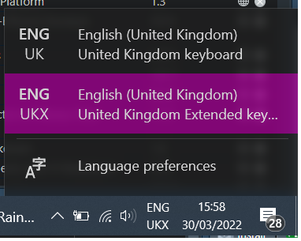

```{r setup, include=FALSE}
knitr::opts_chunk$set(echo = FALSE)
```

```{r intro-pic, fig.cap="Photo of a tree from below in the warm Winter light", echo=FALSE, eval=TRUE}
knitr::include_graphics("img/tree-in-winter-light.png")
```

I recently got a new laptop, an upgrade from the standard NHS Trust issue, which now means I can open more than one session of RStudio and have lots of other Microsoft programs open without the fan going crazy as it overheats. I should be grateful, and I am, but I've spent a long time trying to find out how to type my name as there is no numeric keypad or shared letter/numbers on the keyboard. It's not like I don't type my own name much or anything!

> MS Teams - please introduce yourself in the chat:
> Hello, my name is Zo

Do I write just a plain e? But that's not my name. Do I have to go to another program or the internet to copy the ë every time I need this? That can't be right can it?! 

Even when I think I've got my name entered somewhere it gets changed, like for this distill post, it came through as Zoë which has a certain ring to it.

## Using Alt for ë

If I have a keypad I've used <kbd>Alt+0235</kbd>. 

Microsoft Word has it down as <kbd>Ctrl+:</kbd> then the e or <kbd>Shift+e</kbd> for a capital but that doesn't work globally (so not in MS Teams or RStudio).

## Adding a language - doesn't work

I thought adding another language would be a workaround as I added German as, throughout my childhood I've always heard people say "ë like in German". Only it's not a German character it seems, it appears in French but no one ever said that. I've also heard it said that if you cut a worm half you get two worms which is complete nonsense so I should always question this stuff.

Adding another language like French does give other chacaters but I got é where I hoped I'd get ë.

## Extended keyboard solution

The solution turns out to be pretty convoluted but here it is for future me:

* `Windows button` then `Language settings`
* `Preferred language` is probably already `English (United Kingdom)`
* Click on the language and then `Options`
* `Add keyboard` and scroll down (the list is not in any order) and select `United Kingdom Extended`

The new keyboard appears by the time along the bottom of the screen:



[Toggling between the keyboards](https://support.microsoft.com/en-us/office/switch-between-languages-using-the-language-bar-1c2242c0-fe15-4bc3-99bc-535de6f4f258#:~:text=Keyboard%20shortcut%3A%20To%20switch%20between,of%20the%20active%20keyboard%20layout.) can be done using <kbd>Alt+Shift</kbd> but that just shows the menu which you need to then select the language using the mouse at least on my computer. I thought I'd just need the extended keyboard but it seems that when I use the back tick here in RStudio the extended keyboard only does the ticks if I select it twice and then I get an extra back tick for my efforts.

## Getting the ë

To get the ë, now this is the fun part.

* Hold down the <kbd>alt gr</kbd> key (to the right of the space bar) and select the number <kbd>2</kbd>
* Let go of both keys and then select e or <kbd>Ctrl+e</kbd> for a capital

## Getting other characters

Occasionally I like to use the é character, particularly for Hugo Apéro and my colleagues surname has a special character ú and to get these I hold down the <kbd>alt gr</kbd> key with the letter I want.

This works for the standard keyboard as well as the extended so that's a nice find.