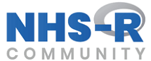

```{r setup, include=FALSE}
knitr::opts_chunk$set(echo = FALSE)

# install.packages("remotes")
# remotes::install_github("mitchelloharawild/icon")
#library(icon) # icons need to be loaded to view so run following code if not already done
# icon::download_fontawesome()
```


```{r nhsr, out.width = "100px"}



```

I am an [NHS-R Community](https://twitter.com/NHSRCommunity) Champion and have written a few blogs on R and the Community [here](https://nhsrcommunity.com/blog/author/z-turner/). I also run some of the Community's Introduction to R and R Studio courses and attended every conference, even speaking at the last couple:

[Why do I need to learn R when I can use SQL?]( https://www.youtube.com/watch?v=5eEaAxeDFRE) 1:05:07

I've also attended panels on behalf of NHS-R Community:

[Insight 2020 and NHS-R: The importance of R](https://www.youtube.com/watch?v=wZQW4LP6rwA)


```{r apha, out.width = "100px"}

knitr::include_graphics("company-logos/Apha-Logo.svg")

```

I am the Non-Executive Director for the [Association of Professional Healthcare Analysts](https://twitter.com/Apha_Analysts), leading specifically on equality, diversity and inclusion. 

Watch me here: [Data challenges in a time of crisis](https://www.youtube.com/watch?v=7kIXDlIJpG0)

## Why Philosopher Analyst?

I studied Philosophy many years ago and had no idea about analysis or programming but I was lucky to get a chance to work with some A&E data in one job and was hooked on data from then on. 
I started out using SQL and my journey into learning R started around the same time as NHS-R Community started. 

Find me on [Twitter](https://twitter.com/Letxuga007) or [LinkedIn](https://uk.linkedin.com/in/zo%C3%AB-turner-9bba4840)

I share my code on [GitHub](https://github.com/Lextuga007)

and my work email is 
[zoe.turner2@nottshc.nhs.uk](mailto:zoe.turner2@nottshc.nhs.uk)
